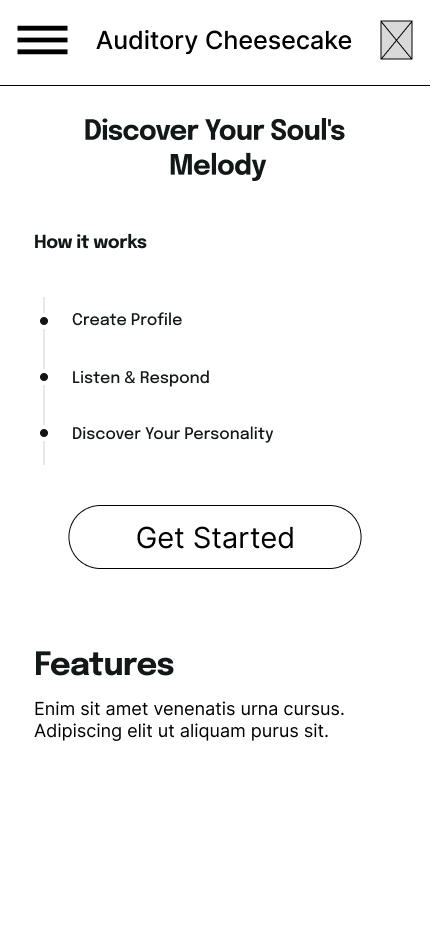

# User Experience Design
# Auditory Cheesecake

## Link to Prototype

[Prototype] (https://www.figma.com/file/1fBfuMT814LlhMGs9xnKog/Assessment-%26-Results?type=design&node-id=0%3A1&mode=design&t=4JjRQlcWaUSccafi-1)

## App Map
](ux-design/App_Map.png)

## Wireframe

### Sign In

This is the sign in page where the user lands when they open the app

### Create Account
If they do not have an account, they can create it

### Home Page 
Before starting the study, the user sees this page to begin

### Sample Question
This is a sample question. Most questions will be mutliple choice. There will be a series of them

### Results
Once the study is completed, they can view their results

.png>)

### Share Results 
They will have the option to share their results with friends

### Hamburger Menu
The hamburger menu allows users to navigate throughout the app

### View User Profile
The user profile is where the user can change their name, password, etc. 

### Change Password
The user can also change their password if they want to.

### Edit User Profile 
If the user wishes to change their user profile, they may do so here

### Terms and Conditions
This is where the terms and conditions will go for the study.

